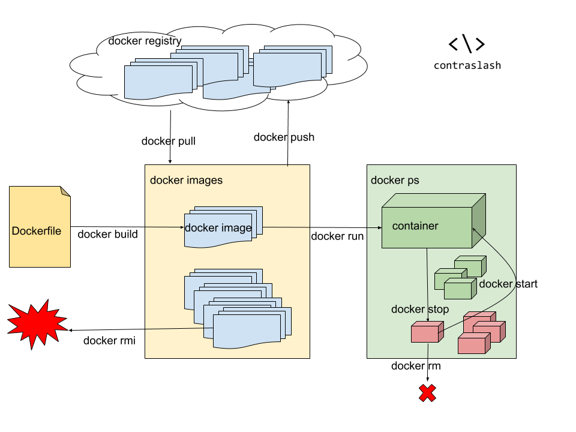

# Una guía rápida de Docker

Charla para el meet up de [Pioneras Dev](http://pionerasdev.co/).

[Post oficial de Medium](https://medium.com/contraslashsas/una-gu%C3%ADa-no-tan-r%C3%A1pida-de-docker-2fab9243762a)

[Descarga docker](https://www.docker.com/get-started)

## Qué es Docker?

> ‘Es una pieza de software liviana, independiente, empaquetable y ejecutable que incluye todo lo que necesita para correr: código, runtime, herramientas de sistema, librerías y configuraciones’ traducido de la página oficial de docker, eso traducido a lenguaje práctico significa que es un pedacito de software que puede ejecutarse por si mismo sin necesidad de nada más. Un proceso que se aloja en la memoria de un anfitrión y que idealmente copia sus características y las extiende para obtener la funcionalidad necesaria. Muy distinto a las máquinas virtuales, pues ellas tienen una copia completa del sistema operativo, mientras que los contenedores solo incluyen las diferencias con respecto al anfitrión. - [Una guía no tan rápida de Docker y Kubernetes](https://medium.com/ingenier%C3%ADa-en-tranqui-finanzas/una-gu%C3%ADa-no-tan-r%C3%A1pida-de-docker-y-kubernetes-933f5b6709df)

## Cómo se compara con una máquina virtual?


## Por qué son útiles?

- Inician y terminan mucho mas rápido que una máquina virtual
- Son portables
- Escalan rápidamente
- Se integran rápidamente a arquitecturas orientadas a microservicios
- Aceleran el proceso de DevOps

## Cómo usar Docker


---
### Dockerfile

```Dockerfile
FROM contraslash/alpine-django-deploy-common:latest
RUN mkdir /code
WORKDIR /code
ADD requirements.txt /code/
RUN pip install --no-cache-dir -r requirements.txt

ADD . /code/

EXPOSE 8000

CMD ["uwsgi", "--ini", "uwsgi.ini"]
```
---


`docker build`: Este comando toma un archivo Dockerfile y lo transforma en una imágen, creando las capas necesarias y almacenándolas en el equipo local con la etiqueta definida con el parámetro -t

```bash
docker build -t contraslash/blog-django-pioneras .
```

---

`docker tag`: A partir de una imagen base, se crea una nueva con la etiqueta definida

```bash
docker tag contraslash/blog-django-pioneras registy.contraslash.com:5000/contraslash/blog-django-pioneras
```
---


`docker images`: Lista las imágenes construidas y disponibles en el sistema

```bash
docker images
```
---

`docker run`: Crea un contenedor a partir de una imagen existente en el sistema, existe se buscará la imagen en el registro por defecto de docker Docker Hub. Este comando suele venir con directivas importantes de ejecución como configuraciones por variables de ambiente con el argumento --env , directivas para ejecutar el contenedor en segundo plano con --detach, el nombre con el que se identificará este contenedor con--name puertos que se van a mapear al equipo anfitrión con --publish , carpetas compartidas con el anfitrión con --volume y muchos otros argumentos para definir por ejemplo límites en procesadores y memoria RAM, redes a la que se conectará, servidores DNS, direcciones IP todos disponibles en la documentación oficial del comando run.
```bash
docker run \
    --env DEBUG=True \
    --name blog_django_pioneras \
    --publish 9000:8000 \
    --volume ${PWD}/media:/code/media \
    --detach \
    contraslash/blog-django-pioneras
```
---


`docker ps`: Muestra los contenedores ejecutándose o detenidos en el sistema

```bash
docker ps
```
---


`docker stop`: Detiene un contenedor en ejecución

```bash
docker stop blog_django_pioneras
```
---


`docker start`: Re inicia la ejecución de un contenedor deteindo
```bash
docker start blog_django_pioneras
```
---


`docker inspect`: Inspecciona un contenedor mostrando toda su configuración

```bash
docker inspect blog_django_pioneras
```
---


`docker logs`: Muestra los registros emitidos por el contenedor especificado

```bash
docker logs blog_django_pioneras
```
---


`docker rm`: Elimina un contenedor detenido

```bash
docker stop blog_django_pioneras && docker rm blog_django_pioneras
```
---


`docker login`: Inicia sesión con un registro de docker. Si no se especifica un nombre de registro, se toma por defecto Docker Hub.

```bash
docker login registry.contraslash.com:5000
```
---


`docker push`: Sube una imagen al registro determinado

```bash
docker push registry.contraslash.com:5000
```
---


`docker pull`: Descarga una imagen desde un registro

```bash
docker pull contraslash/alpine-django-deploy-common-with-pillow
```
---


`docker rmi`: Elimina una imagen

```bash

docker rmi  contraslash/alpine-django-deploy-common-with-pillow
```


## Licencia
El contenido de esta presentación está definido por la licencia Internacional Creative Commons  Attribution-ShareAlike 4.0

Para ver una copia de esta licencia, visite https://creativecommons.org/licenses/by-sa/4.0/deed.es
